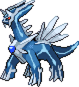

# palettepull
 

A tool to pull a complete colour palette from a directory of sprites.

## Usage
Usage of the tool is very simple. Just call `palettepull "<path-to-sprite/sprite-directory>"`.

The tool will then generate a PNG image named in the format of `<name-of-source-path-base>Palette.png` in the same
location as the directory/sprite that was specified.

## Example
Using `palettepull "media/dialga-sprite.png"` on...

...generates the following palette (blown up to be visible) in the same location as the source:

.")
